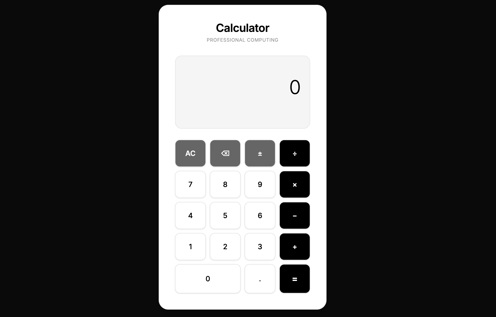

# Calculator — Professional BODMAS Computing

A modern, professional calculator web application with **BODMAS/operator precedence** support and **Hindi word conversion** for results.



## Features

✨ **BODMAS Expression Evaluation** — Calculate complex expressions like `2+3+7-6*2` with correct operator precedence (multiplication/division before addition/subtraction)

🔢 **Hindi Word Conversion** — Results are displayed in Hindi words (e.g., "पाँच" for 5, "शून्य" for 0)

🎵 **Sound Effects** — Button clicks and calculation loading sounds for enhanced UX

⚡ **Keyboard Support** — Full keyboard input support for faster calculations

📱 **Responsive Design** — Professional monochrome theme that works on all devices

## How to Use

1. **Open the Calculator** — Open `index.html` in your web browser
2. **Build Expressions** — Click buttons or use keyboard to type expressions like `10/2+3`
3. **Calculate** — Press `=` or Enter to evaluate the expression with BODMAS rules
4. **View Results** — See the numeric result and Hindi word translation
5. **Clear** — Press `AC` or Escape to start a new calculation

### Keyboard Shortcuts

- **Numbers**: `0-9`
- **Operators**: `+`, `-`, `*`, `/`
- **Decimal**: `.`
- **Calculate**: `Enter` or `=`
- **Clear**: `Escape` or `C`
- **Delete**: `Backspace`

## Technical Implementation

### BODMAS Parser

The calculator uses a safe two-pass expression evaluator (no `eval()`):

1. **Tokenizer** — Splits expressions into numbers and operators, handles negative numbers
2. **Pass 1** — Evaluates all `*` and `/` operations (left to right)
3. **Pass 2** — Evaluates all `+` and `-` operations (left to right)

### Example Calculations

| Expression | Evaluation | Result |
|---|---|---|
| `2+3` | `2+3` | `5` (पाँच) |
| `2+3+7-6*2` | `2+3+7-12` → `12-12` | `0` (शून्य) |
| `10/2+3` | `5+3` | `8` (आठ) |
| `2*3+4*5` | `6+20` | `26` (छब्बीस) |
| `5-3*2+8/4` | `5-6+2` → `1` | `1` (एक) |

## Project Structure

```
Calculater/
├── index.html          # Main HTML structure
├── style.css           # Monochrome professional styling
├── script.js           # BODMAS calculator logic
├── favicon.png         # Calculator icon
└── Assets/
    ├── sounds/         # Sound effect files
    └── preview.png     # Screenshot
```

## Technologies Used

- **HTML5** — Semantic structure
- **CSS3** — Modern monochrome design with glassmorphism
- **Vanilla JavaScript** — No dependencies, pure ES6+
- **Google Fonts** — Inter (Latin) and Noto Sans Devanagari (Hindi)

## Browser Support

Works on all modern browsers:
- Chrome/Edge 90+
- Firefox 88+
- Safari 14+

## Developer

**Developed by Akash Prajapati**

---

*A professional calculator with BODMAS intelligence and Hindi language support.*
